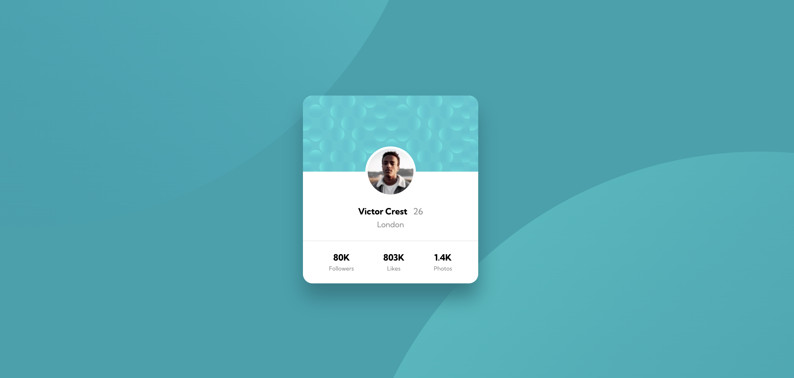
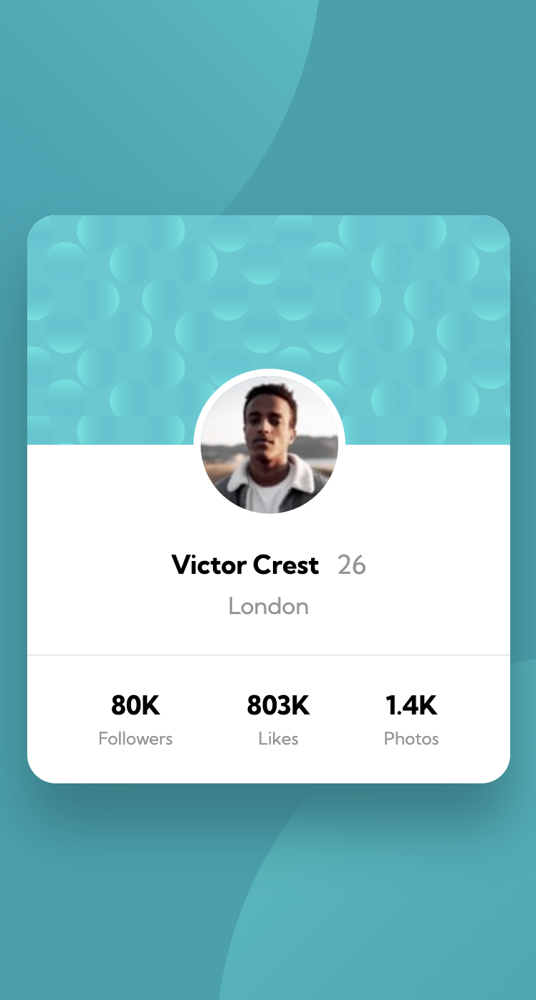

# Frontend Mentor - Profile card component solution

This is a solution to the [Profile card component challenge on Frontend Mentor](https://www.frontendmentor.io/challenges/profile-card-component-cfArpWshJ). Frontend Mentor challenges help you improve your coding skills by building realistic projects. 

## Table of contents

- [Overview](#overview)
  - [The challenge](#the-challenge)
  - [Screenshot](#screenshot)
  - [Links](#links)
- [My process](#my-process)
  - [Built with](#built-with)
  - [What I learned](#what-i-learned)
  - [Continued development](#continued-development)
  - [Useful resources](#useful-resources)
- [Author](#author)
- [Acknowledgments](#acknowledgments)

## Overview

### The challenge

- Build out the project to the designs provided

### Screenshot




### Links

- Live Site URL: [Live Site URL](https://emilyw12.github.io/profile-card-component/)

## My process

### Built with

- HTML5
- CSS
- Flexbox
- Mobile-first workflow

### What I learned

This was the fourth challenge I completed from Frontend Mentor. In the previous challenges, I worked mainly with Flexbox to create the layout, but I needed to get familiar with absolute and relative positioning with this challenge. I had a particularly difficult time with the circle patterns in the background. To tackle the circle patterns, I learned about the ```::before``` and ```::after``` pseudo-elements and how they can be used to create decorations without additional markup, so that's what I chose to use here. Along with absolute positioning, I needed to use ```z-index``` to establish stacking order, which I had neglected to think about until I started using absolute positioning. Finally, I learned a handy trick for positioning an element as a percentage of its own width by using any of the ```top```, ```bottom```, ```left```, ```right``` properties and then using ```transform: translateX(-50%)```. For example, when trying to position the profile photo, I wanted the photo to be centered at 50% of its width and 50% of its height:

```css
.card__profile-photo {
	position: absolute;
	left: 50%;
	transform: translate(-50%,-50%);
	border-radius: 50%;
	border: 5px solid white;

}
```


### Continued development

I will continue to practice being familiar with HTML and CSS, particularly with positioning with CSS and CSS grid. 

### Useful resources

- [Kevin Powell ::before and ::after psuedo elements](https://www.youtube.com/watch?v=djbtPnNmc0I) - Kevin Powell always does a great job explaining CSS concepts, and I learned a lot from this 3-part series on ::before and ::after and specific use cases. I also learned the trick for positioning an element based on a percentage of its width from this series.
- [Example resource 2](https://www.example.com) - This is an amazing article which helped me finally understand XYZ. I'd recommend it to anyone still learning this concept.

**Note: Delete this note and replace the list above with resources that helped you during the challenge. These could come in handy for anyone viewing your solution or for yourself when you look back on this project in the future.**

## Author

- Website - [Add your name here](https://www.your-site.com)
- Frontend Mentor - [@yourusername](https://www.frontendmentor.io/profile/yourusername)
- Twitter - [@yourusername](https://www.twitter.com/yourusername)

**Note: Delete this note and add/remove/edit lines above based on what links you'd like to share.**

## Acknowledgments

This is where you can give a hat tip to anyone who helped you out on this project. Perhaps you worked in a team or got some inspiration from someone else's solution. This is the perfect place to give them some credit.

**Note: Delete this note and edit this section's content as necessary. If you completed this challenge by yourself, feel free to delete this section entirely.**
